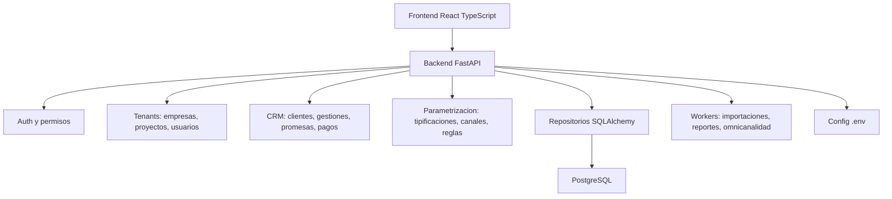

# Arquitectura V2

## Principios

- La V2 no debe concentrar toda la logica en un solo archivo.
- Las rutas HTTP no deben acceder directamente a SQL sin pasar por servicios/repositorios.
- Las variables sensibles no deben estar quemadas en codigo.
- La parametrizacion del producto debe hacerse desde la aplicacion por IcodeUp plataforma.
- Cada empresa cliente debe estar aislada por tenant.

## Capas

## Backend

- `api/routes`: endpoints HTTP.
- `services`: casos de uso y reglas de negocio.
- `repositories`: acceso a datos.
- `models`: modelos SQLAlchemy.
- `schemas`: contratos Pydantic.
- `core`: configuracion, seguridad y logging.
- `tenancy`: resolucion y aislamiento de empresas.
- `workers`: tareas asincronas.

## Frontend

- `features`: modulos por dominio.
- `components`: UI reutilizable.
- `services`: clientes HTTP.
- `app`: layout, rutas y estado global.
- `styles`: sistema visual.

## Migracion Desde V1

1. Autenticacion y sesion.
2. Empresas/proyectos/usuarios.
3. Clientes y cola de gestion.
4. Tipificaciones parametrizables.
5. Canales omnicanalidad.
6. Reporteria y BI.
7. Auditoria e importacion masiva.

